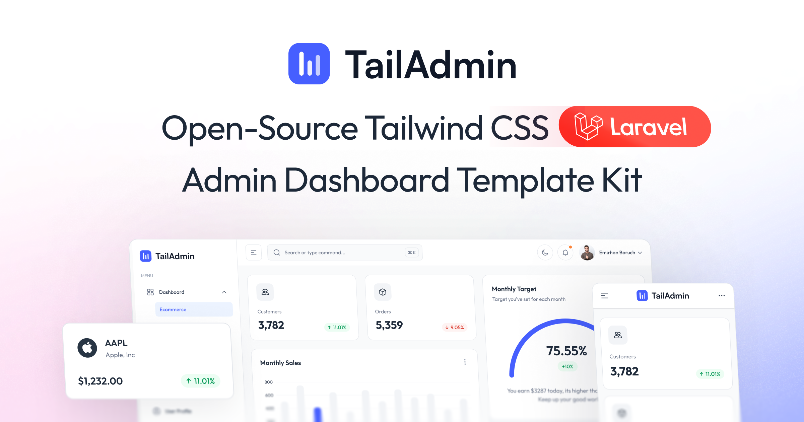

# WFM Reporter - Workforce Management System

**WFM Reporter** es un sistema completo de Workforce Management (WFM) diseñado específicamente para contact centers. Desarrollado con **Laravel 11**, **PostgreSQL**, y **Tailwind CSS**, integra funcionalidades avanzadas de forecasting, staffing, scheduling y Real-Time Adherence (RTA) para optimizar la gestión de personal en entornos de atención al cliente.



## ✨ Características Principales

### 📊 Forecasting y Análisis Predictivo
- **Erlang-C/AHT Calculation**: Modelos matemáticos precisos para predecir volumen de llamadas y tiempo de manejo promedio
- **Intervalos de 15 minutos**: Análisis granular de demanda por intervalos estándar
- **Shrinkage Management**: Cálculo automático de pérdidas por ausencias, capacitación y otras variables

### 👥 Gestión de Personal
- **Staffing Optimization**: Cálculo automático de FTE requeridos basado en niveles de servicio (80/20)
- **Gestión de Skills**: Asignación de competencias y especializaciones por agente
- **Control de Ausencias**: Seguimiento de vacaciones, permisos y ausentismo

### 📅 Programación Inteligente
- **Scheduling Automatizado**: Generación de horarios basada en reglas de negocio y disponibilidad
- **Gestión de Turnos**: Plantillas de turnos flexibles con breaks y rotaciones
- **Workflow de Aprobaciones**: Sistema de solicitudes y aprobaciones para cambios de horario

### 📈 Real-Time Adherence (RTA)
- **Monitoreo en Tiempo Real**: Seguimiento de cumplimiento de horarios vs. actividad real
- **Alertas Automáticas**: Notificaciones de desviaciones y ausencias no programadas
- **Reportes de Adherencia**: Métricas detalladas de cumplimiento por agente y equipo

### 🔐 Seguridad y Control de Acceso
- **RBAC (Role-Based Access Control)**: Roles de Admin, Supervisor, Analista y Agente
- **Autenticación API**: Tokens Sanctum para acceso seguro a endpoints
- **Auditoría**: Registro completo de cambios y operaciones críticas

## 🛠️ Tecnologías Utilizadas

- **Backend**: PHP 8.2+ con Laravel 11.x
- **Base de Datos**: PostgreSQL 15+
- **ORM**: Eloquent ORM con relaciones complejas
- **Autenticación**: Laravel Sanctum para API tokens
- **Autorización**: Spatie Laravel Permission para RBAC
- **Frontend**: Tailwind CSS v4 + Alpine.js para interactividad
- **Build System**: Vite para desarrollo y optimización
- **Testing**: Pest PHP para pruebas automatizadas
- **Queue System**: Laravel Queues para procesamiento asíncrono

## 📋 Requisitos del Sistema

- **PHP**: 8.2 o superior
- **Composer**: Para gestión de dependencias PHP
- **Node.js**: 18+ y npm para assets frontend
- **PostgreSQL**: 15+ para base de datos
- **Git**: Para control de versiones

### Verificar Instalaciones

```bash
php -v          # PHP 8.2+
composer -V     # Composer
node -v         # Node.js 18+
npm -v          # npm
psql --version  # PostgreSQL
```

## 🚀 Instalación y Configuración

### Paso 1: Clonar el Repositorio

```bash
git clone https://github.com/castillostack/workforce.git
cd wfm-reporter
```

### Paso 2: Instalar Dependencias PHP

```bash
composer install
```

### Paso 3: Instalar Dependencias Node.js

```bash
npm install
```

### Paso 4: Configurar Variables de Entorno

```bash
cp .env.example .env
```

Editar `.env` con tus configuraciones:

```env
APP_NAME="WFM Reporter"
APP_ENV=local
APP_KEY=
APP_DEBUG=true
APP_URL=http://localhost

# Base de Datos PostgreSQL
DB_CONNECTION=pgsql
DB_HOST=127.0.0.1
DB_PORT=5432
DB_DATABASE=wfm_reporter
DB_USERNAME=tu_usuario
DB_PASSWORD=tu_password

# Cache y Sesiones
CACHE_DRIVER=file
QUEUE_CONNECTION=database
SESSION_DRIVER=file

# Sanctum para API
SANCTUM_STATEFUL_DOMAINS=localhost,127.0.0.1
```

### Paso 5: Generar Clave de Aplicación

```bash
php artisan key:generate
```

### Paso 6: Configurar Base de Datos

Crear la base de datos en PostgreSQL:

```sql
CREATE DATABASE wfm_reporter;
```

Ejecutar migraciones:

```bash
php artisan migrate
```

### Paso 7: Poblar Datos Iniciales

```bash
php artisan db:seed
```

Esto creará:
- Roles y permisos (admin, supervisor, analyst, agent)
- Usuarios de prueba con empleados asociados
- Departamentos y equipos de ejemplo

### Paso 8: Enlazar Storage

```bash
php artisan storage:link
```

## 🏃 Ejecutar la Aplicación

### Modo Desarrollo (Recomendado)

```bash
composer run dev
```

Este comando inicia automáticamente:
- ✅ Servidor Laravel (http://localhost:8000)
- ✅ Servidor Vite para HMR
- ✅ Worker de colas
- ✅ Monitor de logs

### Configuración Manual

**Terminal 1 - Servidor Laravel:**
```bash
php artisan serve
```

**Terminal 2 - Assets Frontend:**
```bash
npm run dev
```

**Terminal 3 - Colas (opcional):**
```bash
php artisan queue:work
```

## 📖 Uso del Sistema

### Acceso Inicial

Después de ejecutar los seeders, puedes acceder con:

- **Admin**: admin@wfm.com / password123
- **Supervisor**: supervisor@wfm.com / password123
- **Analista**: analyst@wfm.com / password123
- **Agente**: agent@wfm.com / password123

### API Endpoints Principales

#### Autenticación
```bash
# Login
POST /api/login
{
  "username": "admin",
  "password": "password123"
}

# Logout
POST /api/logout
# Headers: Authorization: Bearer {token}

# Usuario autenticado
GET /api/user
```

#### Gestión de Usuarios
```bash
# Perfil
GET /api/profile

# Actualizar perfil
PUT /api/profile

# Cambiar contraseña
POST /api/change-password
```

#### Importación de Datos
```bash
# Importar datos Cisco
POST /api/import/{type}
# Types: calls, agents, chats, etc.
```

#### Reportes
```bash
# Adherencia por agente
GET /api/report/adherence/{employeeId}

# Métricas diarias
GET /api/report/metrics
```

## 🏗️ Arquitectura del Sistema

### Patrón Arquitectural
- **Modular Monolith**: Arquitectura modular dentro de un monolito Laravel
- **Capas Separadas**: Presentación → Servicios → Dominio → Infraestructura
- **Inyección de Dependencias**: Servicios inyectados en controladores

### Estructura de Directorios

```
wfm-reporter/
├── app/
│   ├── Http/Controllers/     # Controladores API
│   ├── Models/              # Modelos Eloquent
│   ├── Services/            # Lógica de negocio
│   │   ├── Core/           # Servicios core
│   │   ├── Wfm/            # Servicios WFM
│   │   ├── Cisco/          # Integración Cisco
│   │   └── Analytics/      # Servicios analíticos
│   ├── Http/Middleware/     # Middleware personalizado
│   └── Providers/          # Service Providers
├── database/
│   ├── migrations/         # Migraciones DB
│   ├── seeders/           # Seeders de datos
│   └── factories/         # Factories para tests
├── resources/
│   ├── views/             # Plantillas Blade
│   ├── css/              # Estilos Tailwind
│   └── js/               # JavaScript Alpine.js
├── routes/
│   ├── api.php           # Rutas API
│   └── web.php           # Rutas web
├── docs/                 # Documentación del proyecto
│   ├── DATA_MODEL.md     # Modelo de datos
│   ├── LOGICAL_ARCH.md   # Arquitectura lógica
│   ├── USE_CASES.md      # Casos de uso
│   └── DDL.md           # Esquema DB
└── tests/               # Pruebas automatizadas
```

### Modelo de Datos

El sistema maneja 27+ tablas organizadas en capas:

- **Raw Data**: Datos crudos de Cisco UCCX
- **Operational**: Datos operativos (usuarios, empleados, horarios)
- **Analytical**: Datos analíticos (métricas, reportes)
- **Quality**: Datos de calidad y forecasting

## 🧪 Testing

Ejecutar suite de pruebas:

```bash
composer run test
```

O manualmente:

```bash
php artisan test
```

Con cobertura:

```bash
php artisan test --coverage
```

## 📜 Comandos Disponibles

### Scripts Composer

```bash
composer run dev      # Ambiente desarrollo completo
composer run test     # Ejecutar tests
```

### Scripts NPM

```bash
npm run dev          # Servidor Vite desarrollo
npm run build        # Build producción
npm run preview      # Preview build
```

### Comandos Artisan

```bash
php artisan migrate:fresh --seed    # Reset DB con datos
php artisan queue:work              # Procesar colas
php artisan route:list              # Listar rutas
php artisan make:controller         # Crear controlador
php artisan make:model -m           # Crear modelo con migración
```

## 🔧 Configuración Avanzada

### Variables de Entorno

```env
# Forecasting
ERLANG_C_PRECISION=4
DEFAULT_SHRINKAGE=0.15

# Service Levels
DEFAULT_SERVICE_LEVEL=0.8
DEFAULT_ANSWER_TIME=20

# Intervals
DEFAULT_INTERVAL_MINUTES=15

# Queue Settings
QUEUE_CONNECTION=database
QUEUE_FAILED_DRIVER=database
```

### Jobs y Colas

Para procesamiento de datos pesados:

```bash
# Procesar importaciones
php artisan queue:work --queue=imports

# Procesar cálculos Erlang
php artisan queue:work --queue=forecasting
```

## 🤝 Contribución

1. Fork el proyecto
2. Crear rama feature (`git checkout -b feature/AmazingFeature`)
3. Commit cambios (`git commit -m 'Add some AmazingFeature'`)
4. Push a la rama (`git push origin feature/AmazingFeature`)
5. Abrir Pull Request

### Estándares de Código

- **PHP**: PSR-12, type hints obligatorios
- **JavaScript**: ESLint configuration
- **Commits**: Conventional commits
- **Tests**: Cobertura mínima 80%

## 📄 Documentación

Documentación completa disponible en `/docs/`:

- **[DATA_MODEL.md](docs/DATA_MODEL.md)**: Modelo de datos detallado
- **[LOGICAL_ARCH.md](docs/LOGICAL_ARCH.md)**: Arquitectura del sistema
- **[USE_CASES.md](docs/USE_CASES.md)**: Casos de uso del negocio
- **[DDL.md](docs/DDL.md)**: Esquema completo de base de datos

## 📝 Licencia

Este proyecto está bajo la Licencia MIT. Ver [LICENSE](LICENSE) para más detalles.

## 👥 Soporte

Para soporte técnico o consultas:
- 📧 Email: soporte@wfm-reporter.com
- 📖 Docs: [Documentación Completa](docs/)
- 🐛 Issues: [GitHub Issues](https://github.com/castillostack/workforce/issues)

---

**Desarrollado con ❤️ para optimizar la gestión de personal en contact centers**